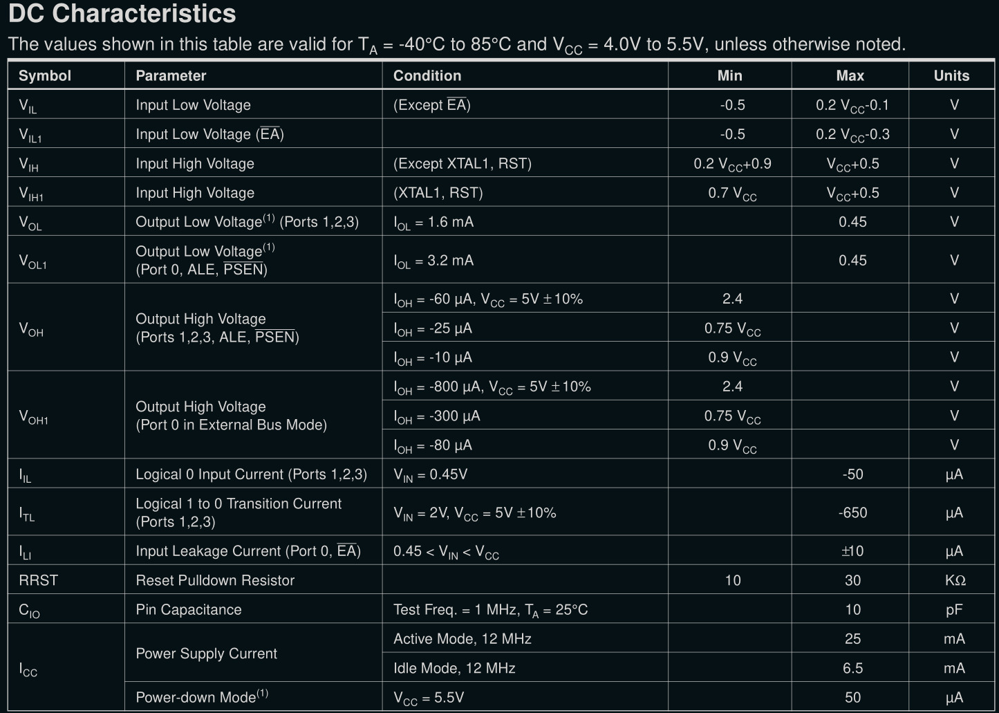

## GPIO in 8051/52

- There are 4, bit addressable Ports in 8051/52 each of which has 8 Pins which
  can be used as bi-directional inputs-outputs.

- Port 1-3 has internall pullup registers while Port 0 does not.

- Writing 0s to the ports makes them act as outputs and writing 1s makes them
work as inputs (high impedence input for Port 0).

- The ports are open drain outputs (don't know what this means). Basically, the
ports can not source much current when 1s are written to the Ports ~ -50 uA.

- Memory mapping of the Ports' SFRs is as follows:

    | Port | Address |
    |------|---------|
    | P0   | 080H    |
    | P1   | 090H    |
    | P2   | 0A0H    |
    | P3   | 0B0H    |

- dc characteristics is shown below:

